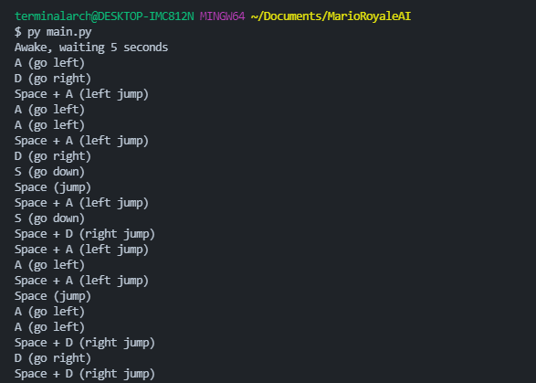
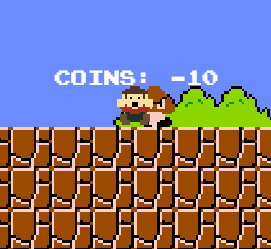

# Mario Royale AI
The very first Mario Royale... AI? No, it's more of an A. 
This [Python](https://python.org) program rolls a dice and chooses a random input once every X seconds 
 
The program logs it's decisions and prints it in the console, and you get to watch it suffer. 
 
There is absolutely zero strategy, good luck having the "AI" pass the 1-1 goomba.

## Version 2.0 Patch Notes
- Added error handler for when configparser is not installed
- Changed countup to be a countdown
- Countdown timer is now customizable
- Input interval no longer subtracts by 8
- Code refactoring
- This project will no longer be receiving updates, since I have ran out of ideas for it.

## Installation
You will need a program and pip to run the software
- Install [Python](https://python.org) from the official website
- Download/clone this repository then extract it to a folder, then cd into it
- Install the **pynput** package from pip3
- Install the **configparser** package from pip3 **OPTIONAL**
- Run `python3 main.py` (or `python main.py` if you're on Windows)

## Notes
The program has a countdown before it starts, but it affects your regular desktop aswell, so make sure you're in [the game](https://marioroyale.tk) before it finishes counting down